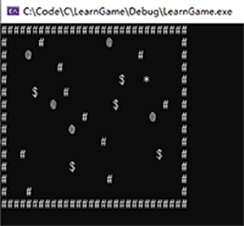
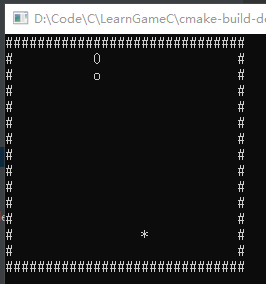

# 游戏入门编程-C++
***
## 简介
&ensp;&ensp;&ensp;&ensp;使用C++编写一些简单怀旧的小游戏,没有实现其中的玩法之类的,只实现核心功能

## 运行说明
*运行平台是Windows*

&ensp;&ensp;&ensp;&ensp;下载压缩包或者使用git都行，完成后使用clion(其他支持cmake工程的也行,环境需要配置好,visual studio应该可以),加载工程进行运行即可

```bash
git clone https://github.com/lw1243925457/LearnGameC.git
```

## 游戏目录
- 数字雨(电影中的窗口一大堆看不懂的东西,比较酷,就简单模拟一个)
- 推箱子
- 贪吃蛇

### 数字雨


### 推箱子
- 简介：
    - 简单的推箱子游戏，将所有箱子推到目的地即可

- 游戏符号标记：
    - 障碍物：#
    - 主角：*
    - 箱子：$
    - 目的地：@
    - 箱子+目的地：!
    - 人物+目的地: R

- 游戏控制：
    - 上下左右键进行移动控制



### 贪吃蛇
- 简介：
    - 贪吃蛇游戏,吃豆子变长

- 游戏符号标记：
    - 障碍物：#
    - 蛇头：0
    - 蛇身：o
    - 豆子：*

- 游戏控制：
    - 上下左右键进行移动控制


