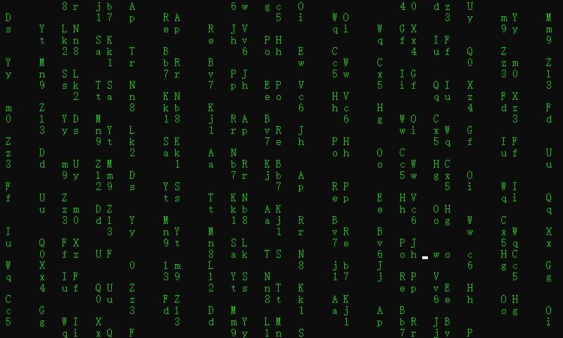
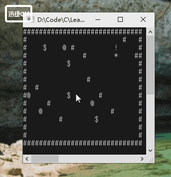
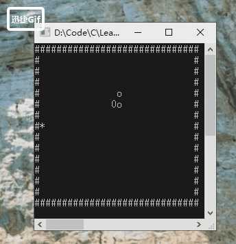
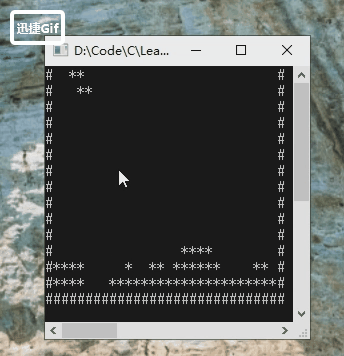

# 游戏入门编程-C++
***
## 简介
&ensp;&ensp;&ensp;&ensp;使用C++编写一些简单怀旧的小游戏,没有实现其中的玩法之类的,只实现核心功能

## 运行说明
*运行平台是Windows*

&ensp;&ensp;&ensp;&ensp;下载压缩包或者使用git都行，完成后使用clion(其他支持cmake工程的也行,环境需要配置好,visual studio应该可以),加载工程进行运行即可

```bash
git clone https://github.com/lw1243925457/LearnGameC.git
```

## 游戏目录
- 数字雨(电影中的窗口一大堆看不懂的东西,比较酷,就简单模拟一个)
- 推箱子
- 贪吃蛇
- 俄罗斯方块(使用特殊符号容易乱码,也不好处理,就简单使用了*和#,看着有点眼花......)
- 太空射击(暂无死亡)

### 数字雨


### 推箱子
- 简介：
    - 简单的推箱子游戏，将所有箱子推到目的地即可

- 游戏符号标记：
    - 障碍物：#
    - 主角：*
    - 箱子：$
    - 目的地：@
    - 箱子+目的地：!
    - 人物+目的地: R

- 游戏控制：
    - 上下左右键进行移动控制



### 贪吃蛇
- 简介：
    - 贪吃蛇游戏,吃豆子变长

- 游戏符号标记：
    - 障碍物：#
    - 蛇头：0
    - 蛇身：o
    - 豆子：*

- 游戏控制：
    - 上下左右键进行移动控制
    - 空格开始游戏



### 俄罗斯方块
- 简介：
    - 俄罗斯方块

- 游戏符号标记：
    - 障碍物：#
    - 方块：*

- 游戏控制：
    - 下左右键进行移动控制
    - 空格进行变换



### 太空射击
- 简介：
    - 太空射击,简单的射击类游戏

- 游戏符号标记：
    - 主角:A
    - 子弹:I
    - 敌机:V

- 游戏控制：
    - 下左右键进行移动控制
    - 空格进行射击


## 编写过程中的参考链接
- C/C++获取系统时间戳，精确到毫秒:https://blog.csdn.net/liyunlong41/article/details/76933575
- C++写一个限时输入功能，超过时间执行其他操作:https://blog.csdn.net/dulingmo/article/details/81077071
- CLion 输出遇到乱码解决办法:https://blog.csdn.net/Cbk_XLL/article/details/78752534
- win10 Clion debug 使用 cmd控制台:https://blog.csdn.net/qq_32767041/article/details/
- C++ 中的容器类详解:https://blog.csdn.net/tju_fengbo/article/details/81978595
- C语言 双缓冲控制台防闪屏技术:https://blog.csdn.net/weixinhum/article/details/72179593
- 控制台双缓冲技术:https://www.cnblogs.com/xdblog/p/4783364.html
- C程序之修改Windows的控制台大小:https://www.cnblogs.com/iloverain/p/5642588.html

- C语言/C++程序员大神打造炫酷的黑客帝国数字雨:https://www.jianshu.com/p/4dde809eb039
- C/C++实现控制台输出不同颜色字体的方法:https://www.jb51.net/article/124054.htm
- C++更改控制台（SetConsoleTextAttribute）的输出的颜色:https://blog.csdn.net/TweeChalice/article/details/96496625

- 在平面中，一个点绕任意点旋转θ度后的点的坐标:https://www.cnblogs.com/fengliu-/p/10944151.html
- 俄罗斯方块的相关算法:https://zhuanlan.zhihu.com/p/32122479
- 如何在VC 6.0 上输出特殊符号比如一个黑色的实心方块:https://blog.csdn.net/ahuang1900/article/details/8948672